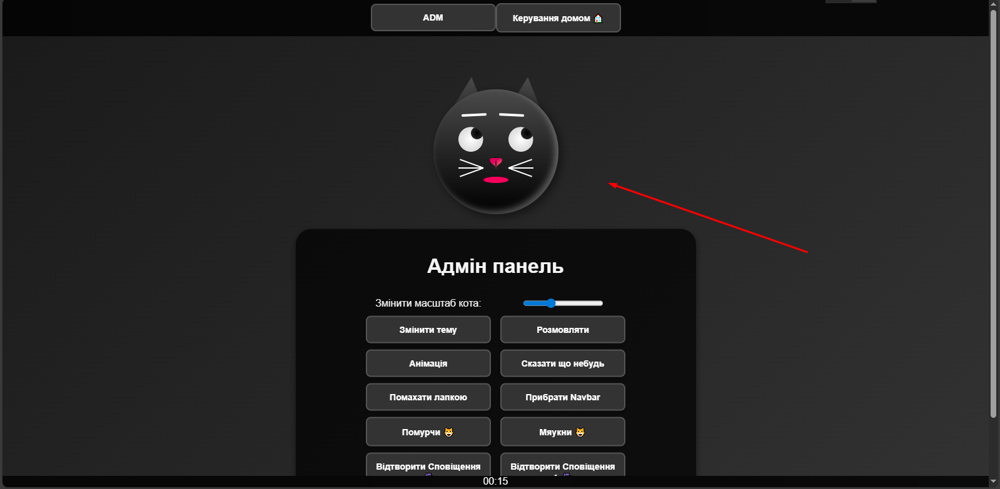
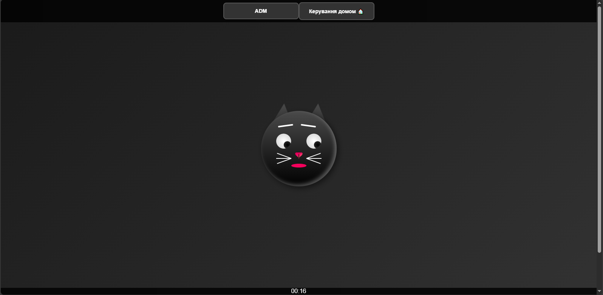
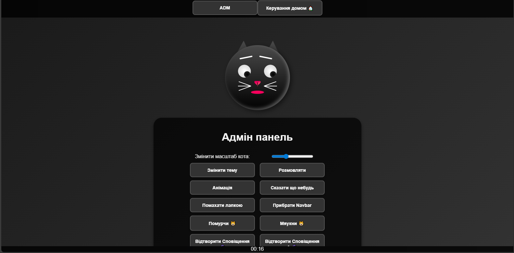
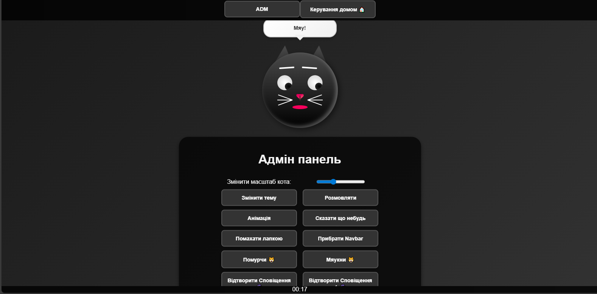

# 🐱 Sirius Cat Assistant (Alpha)

Альфа-версія інтерактивного веб-асистента у вигляді котика 🐾  
Цей проект об’єднує **анімації**, **адмін панель** та ідею майбутнього AI-помічника.  
Наразі це **демо-версія** без справжньої AI-логіки.

---

## ✨ Функціонал (наразі)
- ⚡ **Адмін панель** — зміна теми, масштабування кота, активація анімацій.
- 😺 **Емоційний котик** — може показувати емоції, мурчати, махати лапкою, видавати прості репліки.
- 🎨 **Анімації та теми** — кастомізація вигляду.
- 🏠 **Кнопка "керування домом"** (поки що заглушка для майбутніх сценаріїв).
- 🗨️ **Репліки в чат-бульбашках**.

---

## 🚀 Технології
- HTML / CSS (адаптивний темний інтерфейс)
- JavaScript (анімації, інтерактивність, адмін панель)
- (майбутнє) AI / API для голосових команд

---

## 🤖 AI Generated Notice


> ⚠️ Це **альфа-версія**, в якій поки що немає інтеграції AI.  
> Позначка **AI-Generated** означає, що проект було створено **за допомогою ШІ-інструментів** (генерація коду, опису, дизайну).  
> Сам асистент наразі працює як **демо-прототип**.

---

## 📸 Скриншоти

### 🖥️ Адмін панель


### 🐱 Анімації кота


### 🎤 Репліки кота


### 🐾 Інший екран


---

## 🛠️ Встановлення
```bash
git clone https://github.com/your-username/sirius-cat-assistant-alpha.git
cd sirius-cat-assistant-alpha

